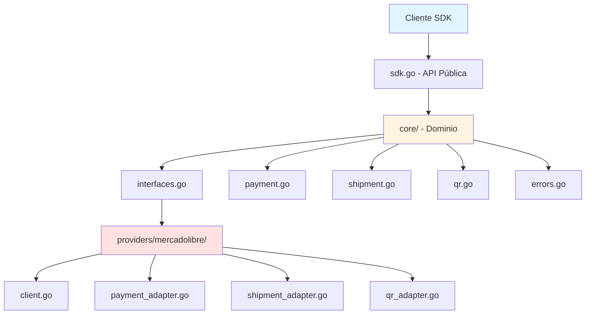
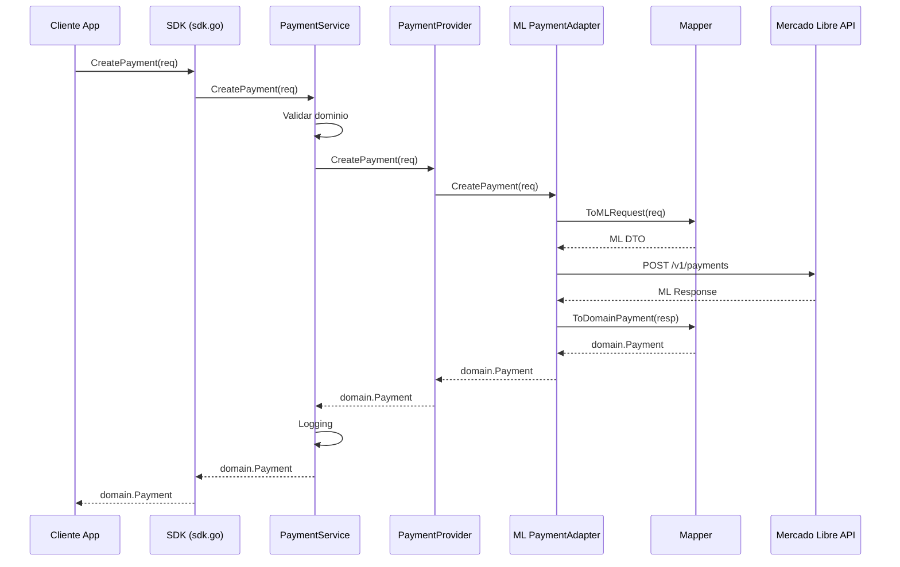

# SDK Mercado Libre para Golang: Pagos, Envíos y QR con Clean Architecture

## Objetivo

Desarrollar un SDK en Go que abstraiga las APIs de Mercado Libre (pagos, envíos y QR) siguiendo Clean Architecture y principios SOLID, diseñado desde el primer commit como una **librería de dominio reusable** que inicia con Mercado Libre como primer proveedor pero permite evolucionar a múltiples proveedores sin reescribir el código cliente.

---

## Diagrama de Arquitectura



---

## Estructura del Proyecto

```
SDK-MercadoLibre/
├── go.mod
├── go.sum
├── README.md
├── LICENSE
├── .gitignore
├── sdk.go                          # API pública del SDK
├── config.go                       # Configuración del SDK
│
├── core/                           # Capa de Dominio (neutro)
│   ├── domain/
│   │   ├── payment.go              # Entidades de pago
│   │   ├── shipment.go             # Entidades de envío
│   │   ├── qr.go                   # Entidades de QR
│   │   ├── common.go               # Tipos comunes (Address, Money, etc.)
│   │   └── enums.go                # Estados, métodos de pago, etc.
│   │
│   ├── ports/                      # Interfaces (Dependency Inversion)
│   │   ├── payment_provider.go
│   │   ├── shipment_provider.go
│   │   ├── qr_provider.go
│   │   └── webhook_handler.go
│   │
│   ├── usecases/                   # Casos de uso (orquestación)
│   │   ├── payment_service.go
│   │   ├── shipment_service.go
│   │   └── qr_service.go
│   │
│   └── errors/                     # Errores de dominio unificados
│       └── errors.go
│
├── providers/                      # Adaptadores de proveedores
│   └── mercadolibre/
│       ├── client.go               # Cliente HTTP base
│       ├── auth.go                 # OAuth2 / API keys
│       ├── config.go               # Configuración específica de ML
│       │
│       ├── payment/
│       │   ├── adapter.go          # Implementa PaymentProvider
│       │   ├── mapper.go           # Mapea ML models <-> Core domain
│       │   └── models.go           # DTOs de la API de ML
│       │
│       ├── shipment/
│       │   ├── adapter.go
│       │   ├── mapper.go
│       │   └── models.go
│       │
│       ├── qr/
│       │   ├── adapter.go
│       │   ├── mapper.go
│       │   └── models.go
│       │
│       └── webhook/
│           ├── handler.go          # Implementa WebhookHandler
│           ├── validator.go        # Validación de firma HMAC
│           └── models.go
│
├── pkg/                            # Utilidades compartidas
│   ├── http/
│   │   ├── client.go               # HTTP client reutilizable
│   │   └── retry.go                # Retry logic
│   │
│   ├── logger/
│   │   └── logger.go               # Interface de logging
│   │
│   └── validator/
│       └── validator.go            # Validaciones genéricas
│
├── examples/                       # Ejemplos de uso
│   ├── payment/
│   │   ├── create_payment.go
│   │   ├── query_payment.go
│   │   └── refund.go
│   │
│   ├── shipment/
│   │   ├── create_shipment.go
│   │   ├── track_shipment.go
│   │   └── cancel_shipment.go
│   │
│   ├── qr/
│   │   ├── generate_qr.go
│   │   ├── query_qr_status.go
│   │   └── webhook_server.go
│   │
│   └── full_flow/
│       └── ecommerce_flow.go       # Flujo completo: pago + envío
│
└── tests/                          # Tests
    ├── unit/
    │   ├── core/
    │   └── providers/
    │
    ├── integration/
    │   └── mercadolibre/
    │
    └── mocks/
        ├── mock_payment_provider.go
        ├── mock_shipment_provider.go
        └── mock_qr_provider.go
```

---

## Implementación por Capas

### 1. Capa de Dominio (`core/`)

**Responsabilidad:** Define el lenguaje ubicuo del SDK, independiente de proveedores.

#### `core/domain/payment.go`
```go
type PaymentMethod string

const (
    PaymentMethodCard         PaymentMethod = "card"
    PaymentMethodTransfer     PaymentMethod = "transfer"
    PaymentMethodCash         PaymentMethod = "cash"
    PaymentMethodQR           PaymentMethod = "qr"
)

type PaymentStatus int

const (
    PaymentStatusPending PaymentStatus = iota
    PaymentStatusApproved
    PaymentStatusRejected
    PaymentStatusCancelled
    PaymentStatusInProcess
    PaymentStatusRefunded
)

type Payment struct {
    ID                string
    ExternalReference string  // Crítico para trazabilidad
    Amount            Money
    Description       string
    Method            PaymentMethod
    Status            PaymentStatus
    Payer             Payer
    Metadata          map[string]interface{}
    CreatedAt         time.Time
    UpdatedAt         time.Time
}

type CreatePaymentRequest struct {
    ExternalReference string
    Amount            Money
    Description       string
    Method            PaymentMethod
    Payer             Payer
    Token             string  // Para tarjetas
    Installments      int
    Metadata          map[string]interface{}
}
```

#### `core/domain/shipment.go`
```go
type ShipmentStatus int

const (
    ShipmentStatusPending ShipmentStatus = iota
    ShipmentStatusReadyToShip
    ShipmentStatusInTransit
    ShipmentStatusDelivered
    ShipmentStatusCancelled
    ShipmentStatusReturned
)

type Shipment struct {
    ID                string
    OrderID           string
    ExternalReference string
    Status            ShipmentStatus
    Origin            Address
    Destination       Address
    Package           Package
    Carrier           Carrier
    TrackingNumber    string
    Label             LabelInfo
    Events            []ShipmentEvent
    CreatedAt         time.Time
    UpdatedAt         time.Time
}

type CreateShipmentRequest struct {
    OrderID           string
    ExternalReference string
    Origin            Address
    Destination       Address
    Package           Package
    ServiceType       string
}
```

#### `core/domain/qr.go`
```go
type QRType string

const (
    QRTypeDynamic QRType = "dynamic"  // Monto fijo
    QRTypeStatic  QRType = "static"   // Monto variable
)

type QRStatus int

const (
    QRStatusActive QRStatus = iota
    QRStatusPending
    QRStatusApproved
    QRStatusRejected
    QRStatusExpired
    QRStatusCancelled
)

type QRCode struct {
    ID                string
    POSID             string
    CollectorID       string
    Type              QRType
    Status            QRStatus
    ExternalReference string
    Amount            *Money  // nil para QR estático
    QRData            string  // Contenido del QR
    ImageURL          string
    ExpiresAt         *time.Time
    Payment           *Payment  // Pago asociado
    CreatedAt         time.Time
    UpdatedAt         time.Time
}

type CreateQRRequest struct {
    POSID             string
    CollectorID       string
    Type              QRType
    ExternalReference string
    Amount            *Money
    Description       string
    ExpirationMinutes int
}
```

#### `core/domain/common.go`
```go
type Money struct {
    Amount   float64
    Currency string  // "MXN", "ARS", etc.
}

type Address struct {
    Street     string
    Number     string
    Floor      string
    Apartment  string
    City       string
    State      string
    ZipCode    string
    Country    string
    Lat        float64
    Lon        float64
}

type Payer struct {
    Email       string
    FirstName   string
    LastName    string
    Phone       string
    Identification Identification
}

type Identification struct {
    Type   string
    Number string
}

type Package struct {
    Weight      float64  // kg
    Length      float64  // cm
    Width       float64
    Height      float64
    Description string
}
```

#### `core/errors/errors.go`
```go
type ErrorCode string

const (
    ErrCodeInvalidRequest    ErrorCode = "INVALID_REQUEST"
    ErrCodeUnauthorized      ErrorCode = "UNAUTHORIZED"
    ErrCodeNotFound          ErrorCode = "NOT_FOUND"
    ErrCodeInsufficientFunds ErrorCode = "INSUFFICIENT_FUNDS"
    ErrCodeInvalidCard       ErrorCode = "INVALID_CARD"
    ErrCodeFraudRejection    ErrorCode = "FRAUD_REJECTION"
    ErrCodeTimeout           ErrorCode = "TIMEOUT"
    ErrCodeProviderError     ErrorCode = "PROVIDER_ERROR"
)

type SDKError struct {
    Code           ErrorCode
    Message        string
    ProviderCode   string
    ProviderMessage string
    Details        map[string]interface{}
}

func (e *SDKError) Error() string {
    return fmt.Sprintf("[%s] %s", e.Code, e.Message)
}
```

---

### 2. Capa de Puertos (`core/ports/`)

**Responsabilidad:** Interfaces que deben implementar los proveedores (Dependency Inversion Principle).

#### `core/ports/payment_provider.go`
```go
type PaymentProvider interface {
    // Creación de pagos
    CreatePayment(ctx context.Context, req *domain.CreatePaymentRequest) (*domain.Payment, error)
    
    // Consulta
    GetPayment(ctx context.Context, id string) (*domain.Payment, error)
    ListPayments(ctx context.Context, filters PaymentFilters) ([]*domain.Payment, error)
    
    // Reembolsos
    RefundPayment(ctx context.Context, paymentID string, amount *domain.Money) (*domain.Payment, error)
    
    // Cancelación
    CancelPayment(ctx context.Context, paymentID string) error
}

type PaymentFilters struct {
    ExternalReference string
    Status            domain.PaymentStatus
    FromDate          time.Time
    ToDate            time.Time
    Limit             int
    Offset            int
}
```

#### `core/ports/shipment_provider.go`
```go
type ShipmentProvider interface {
    // Creación
    CreateShipment(ctx context.Context, req *domain.CreateShipmentRequest) (*domain.Shipment, error)
    
    // Consulta
    GetShipment(ctx context.Context, id string) (*domain.Shipment, error)
    GetShipmentByOrder(ctx context.Context, orderID string) (*domain.Shipment, error)
    
    // Tracking
    GetTracking(ctx context.Context, shipmentID string) ([]*domain.ShipmentEvent, error)
    
    // Actualización
    UpdateShipment(ctx context.Context, id string, req *domain.UpdateShipmentRequest) (*domain.Shipment, error)
    
    // Cancelación
    CancelShipment(ctx context.Context, id string) error
    
    // Etiquetas
    GetLabel(ctx context.Context, shipmentID string) ([]byte, error)  // PDF
}
```

#### `core/ports/qr_provider.go`
```go
type QRProvider interface {
    // Creación
    CreateQR(ctx context.Context, req *domain.CreateQRRequest) (*domain.QRCode, error)
    
    // Consulta
    GetQR(ctx context.Context, qrID string) (*domain.QRCode, error)
    GetQRByExternalReference(ctx context.Context, ref string) (*domain.QRCode, error)
    
    // Gestión
    RegenerateQR(ctx context.Context, qrID string) (*domain.QRCode, error)
    CancelQR(ctx context.Context, qrID string) error
    
    // POS
    RegisterPOS(ctx context.Context, req *RegisterPOSRequest) (*POSInfo, error)
    ListPOS(ctx context.Context, collectorID string) ([]*POSInfo, error)
}
```

#### `core/ports/webhook_handler.go`
```go
type WebhookHandler interface {
    ValidateSignature(payload []byte, signature string) error
    ParsePaymentWebhook(payload []byte) (*PaymentWebhookEvent, error)
    ParseShipmentWebhook(payload []byte) (*ShipmentWebhookEvent, error)
}

type PaymentWebhookEvent struct {
    Type      string
    Action    string
    PaymentID string
    Data      map[string]interface{}
}
```

---

### 3. Capa de Casos de Uso (`core/usecases/`)

**Responsabilidad:** Orquestar lógica de negocio, independiente de proveedores.

#### `core/usecases/payment_service.go`
```go
type PaymentService struct {
    provider ports.PaymentProvider
    logger   logger.Logger
}

func NewPaymentService(provider ports.PaymentProvider, logger logger.Logger) *PaymentService {
    return &PaymentService{
        provider: provider,
        logger:   logger,
    }
}

func (s *PaymentService) CreatePayment(ctx context.Context, req *domain.CreatePaymentRequest) (*domain.Payment, error) {
    // Validaciones de dominio
    if err := s.validatePaymentRequest(req); err != nil {
        return nil, err
    }
    
    // Logging
    s.logger.Info("Creating payment", "external_ref", req.ExternalReference)
    
    // Delegar al provider
    payment, err := s.provider.CreatePayment(ctx, req)
    if err != nil {
        s.logger.Error("Failed to create payment", "error", err)
        return nil, err
    }
    
    // Post-procesamiento si fuera necesario
    s.logger.Info("Payment created", "id", payment.ID, "status", payment.Status)
    
    return payment, nil
}

func (s *PaymentService) validatePaymentRequest(req *domain.CreatePaymentRequest) error {
    if req.ExternalReference == "" {
        return &errors.SDKError{
            Code:    errors.ErrCodeInvalidRequest,
            Message: "external_reference is required",
        }
    }
    if req.Amount.Amount <= 0 {
        return &errors.SDKError{
            Code:    errors.ErrCodeInvalidRequest,
            Message: "amount must be positive",
        }
    }
    return nil
}

// Implementar GetPayment, RefundPayment, etc.
```

---

### 4. Capa de Adaptadores (`providers/mercadolibre/`)

**Responsabilidad:** Implementar las interfaces de `ports/` para Mercado Libre.

#### `providers/mercadolibre/client.go`
```go
type Client struct {
    baseURL    string
    apiKey     string
    httpClient *http.Client
    logger     logger.Logger
}

func NewClient(config Config, logger logger.Logger) *Client {
    return &Client{
        baseURL:    config.BaseURL,
        apiKey:     config.APIKey,
        httpClient: &http.Client{Timeout: 30 * time.Second},
        logger:     logger,
    }
}

func (c *Client) doRequest(ctx context.Context, method, path string, body interface{}, result interface{}) error {
    // Implementar lógica HTTP con:
    // - Headers (Authorization, Content-Type)
    // - Retry logic
    // - Error handling
    // - Logging
}
```

#### `providers/mercadolibre/payment/adapter.go`
```go
type PaymentAdapter struct {
    client *Client
    mapper *PaymentMapper
}

func NewPaymentAdapter(client *Client) *PaymentAdapter {
    return &PaymentAdapter{
        client: client,
        mapper: NewPaymentMapper(),
    }
}

// Implementa ports.PaymentProvider
func (a *PaymentAdapter) CreatePayment(ctx context.Context, req *domain.CreatePaymentRequest) (*domain.Payment, error) {
    // 1. Mapear domain.CreatePaymentRequest -> ML DTO
    mlReq := a.mapper.ToMLCreatePaymentRequest(req)
    
    // 2. Llamar a la API de ML
    var mlResp MLPaymentResponse
    err := a.client.doRequest(ctx, "POST", "/v1/payments", mlReq, &mlResp)
    if err != nil {
        return nil, a.mapError(err)
    }
    
    // 3. Mapear ML DTO -> domain.Payment
    payment := a.mapper.ToDomainPayment(&mlResp)
    
    return payment, nil
}

func (a *PaymentAdapter) mapError(err error) error {
    // Convertir errores de ML a errors.SDKError
}
```

#### `providers/mercadolibre/payment/mapper.go`
```go
type PaymentMapper struct{}

func (m *PaymentMapper) ToMLCreatePaymentRequest(req *domain.CreatePaymentRequest) *MLCreatePaymentRequest {
    return &MLCreatePaymentRequest{
        TransactionAmount: req.Amount.Amount,
        Description:       req.Description,
        PaymentMethodID:   m.mapPaymentMethod(req.Method),
        ExternalReference: req.ExternalReference,
        Payer: MLPayer{
            Email: req.Payer.Email,
            // ...
        },
        // ...
    }
}

func (m *PaymentMapper) ToDomainPayment(ml *MLPaymentResponse) *domain.Payment {
    return &domain.Payment{
        ID:                ml.ID,
        ExternalReference: ml.ExternalReference,
        Amount: domain.Money{
            Amount:   ml.TransactionAmount,
            Currency: ml.CurrencyID,
        },
        Status:    m.mapStatus(ml.Status),
        CreatedAt: ml.DateCreated,
        // ...
    }
}

func (m *PaymentMapper) mapPaymentMethod(method domain.PaymentMethod) string {
    // Mapear enums del dominio a strings de ML
}

func (m *PaymentMapper) mapStatus(status string) domain.PaymentStatus {
    switch status {
    case "pending":
        return domain.PaymentStatusPending
    case "approved":
        return domain.PaymentStatusApproved
    // ...
    }
}
```

#### `providers/mercadolibre/payment/models.go`
```go
// DTOs de la API de Mercado Libre
type MLCreatePaymentRequest struct {
    TransactionAmount float64  `json:"transaction_amount"`
    Description       string   `json:"description"`
    PaymentMethodID   string   `json:"payment_method_id"`
    ExternalReference string   `json:"external_reference"`
    Payer             MLPayer  `json:"payer"`
    Token             string   `json:"token,omitempty"`
    Installments      int      `json:"installments,omitempty"`
}

type MLPaymentResponse struct {
    ID                string    `json:"id"`
    Status            string    `json:"status"`
    StatusDetail      string    `json:"status_detail"`
    ExternalReference string    `json:"external_reference"`
    TransactionAmount float64   `json:"transaction_amount"`
    CurrencyID        string    `json:"currency_id"`
    DateCreated       time.Time `json:"date_created"`
    DateApproved      time.Time `json:"date_approved"`
    // ...
}
```

#### `providers/mercadolibre/webhook/handler.go`
```go
type WebhookHandler struct {
    secret string
}

func NewWebhookHandler(secret string) *WebhookHandler {
    return &WebhookHandler{secret: secret}
}

func (h *WebhookHandler) ValidateSignature(payload []byte, signature string) error {
    // Validar firma HMAC SHA256
    mac := hmac.New(sha256.New, []byte(h.secret))
    mac.Write(payload)
    expected := hex.EncodeToString(mac.Sum(nil))
    
    if !hmac.Equal([]byte(expected), []byte(signature)) {
        return &errors.SDKError{
            Code:    errors.ErrCodeUnauthorized,
            Message: "invalid webhook signature",
        }
    }
    return nil
}

func (h *WebhookHandler) ParsePaymentWebhook(payload []byte) (*ports.PaymentWebhookEvent, error) {
    var raw map[string]interface{}
    if err := json.Unmarshal(payload, &raw); err != nil {
        return nil, err
    }
    
    return &ports.PaymentWebhookEvent{
        Type:      raw["type"].(string),
        Action:    raw["action"].(string),
        PaymentID: raw["data"].(map[string]interface{})["id"].(string),
        Data:      raw,
    }, nil
}
```

---

### 5. API Pública (`sdk.go`)

**Responsabilidad:** Punto de entrada del SDK, oculta toda la complejidad interna.

```go
package mercadolibre

import (
    "context"
    "github.com/tu-org/mercadolibre-sdk/core/domain"
    "github.com/tu-org/mercadolibre-sdk/core/usecases"
    "github.com/tu-org/mercadolibre-sdk/providers/mercadolibre"
)

type SDK struct {
    Payment  *usecases.PaymentService
    Shipment *usecases.ShipmentService
    QR       *usecases.QRService
    Webhook  ports.WebhookHandler
}

func NewSDK(config Config) (*SDK, error) {
    // Crear cliente base
    mlClient := mercadolibre.NewClient(mercadolibre.Config{
        BaseURL: config.BaseURL,
        APIKey:  config.APIKey,
    }, config.Logger)
    
    // Crear adaptadores
    paymentAdapter := mercadolibre.NewPaymentAdapter(mlClient)
    shipmentAdapter := mercadolibre.NewShipmentAdapter(mlClient)
    qrAdapter := mercadolibre.NewQRAdapter(mlClient)
    
    // Crear servicios de dominio
    paymentService := usecases.NewPaymentService(paymentAdapter, config.Logger)
    shipmentService := usecases.NewShipmentService(shipmentAdapter, config.Logger)
    qrService := usecases.NewQRService(qrAdapter, config.Logger)
    
    // Webhook handler
    webhookHandler := mercadolibre.NewWebhookHandler(config.WebhookSecret)
    
    return &SDK{
        Payment:  paymentService,
        Shipment: shipmentService,
        QR:       qrService,
        Webhook:  webhookHandler,
    }, nil
}

// Ejemplo de uso:
// sdk, _ := mercadolibre.NewSDK(config)
// payment, err := sdk.Payment.CreatePayment(ctx, req)
```

---

## Secuencias de Implementación

### Fase 1: Fundación (Wrapper Controlado)

**Objetivo:** SDK funcional con Mercado Libre, arquitectura preparada para evolucionar.

1. **Setup del proyecto**
   - Inicializar `go.mod`
   - Crear estructura de directorios completa
   - Configurar `.gitignore`, `LICENSE`, `README.md`
   - Configurar linter (golangci-lint)

2. **Capa de Dominio (core/)**
   - Definir entidades: `Payment`, `Shipment`, `QRCode`, `Money`, `Address`
   - Definir enums: `PaymentStatus`, `ShipmentStatus`, `PaymentMethod`
   - Crear `errors.go` con errores unificados
   - Definir interfaces en `ports/`

3. **Cliente Base (providers/mercadolibre/)**
   - Implementar `client.go` con HTTP client
   - Autenticación OAuth2 / API Key
   - Retry logic
   - Error handling

4. **Adaptador de Pagos**
   - `payment/models.go`: DTOs de ML
   - `payment/mapper.go`: Conversión bidireccional
   - `payment/adapter.go`: Implementar `PaymentProvider`
   - Endpoints:
     - `POST /v1/payments` (crear)
     - `GET /v1/payments/{id}` (consultar)
     - `POST /v1/payments/{id}/refunds` (reembolso)

5. **Caso de Uso de Pagos**
   - `usecases/payment_service.go`
   - Validaciones de dominio
   - Logging

6. **API Pública**
   - `sdk.go`: Exponer `Payment` service
   - `config.go`: Configuración del SDK

7. **Ejemplo básico**
   - `examples/payment/create_payment.go`

8. **Tests unitarios**
   - Mocks de `PaymentProvider`
   - Tests de `PaymentService`
   - Tests de mapper

---

### Fase 2: Expansión de Funcionalidades

**Objetivo:** Completar pagos, envíos y QR.

9. **Completar Adaptador de Pagos**
   - Listar pagos con filtros
   - Cancelación
   - Manejo de errores específicos (fondos, tarjeta inválida, etc.)

10. **Webhooks de Pagos**
    - `webhook/handler.go`: Validación de firma
    - `webhook/models.go`: Eventos
    - Parser de webhooks
    - Ejemplo de servidor webhook

11. **Adaptador de Envíos**
    - `shipment/models.go`, `mapper.go`, `adapter.go`
    - Endpoints:
      - `POST /shipments` (crear)
      - `GET /shipments/{id}` (consultar)
      - `GET /shipments/{id}/tracking` (tracking)
      - `PUT /shipments/{id}` (actualizar)
      - `POST /shipments/{id}/cancel` (cancelar)
      - `GET /shipments/{id}/labels` (etiqueta PDF)

12. **Caso de Uso de Envíos**
    - `usecases/shipment_service.go`
    - Validaciones

13. **Adaptador de QR**
    - `qr/models.go`, `mapper.go`, `adapter.go`
    - Endpoints:
      - `POST /instore/orders/qr/seller/collectors/{user_id}/pos/{pos_id}/qrs` (crear QR)
      - `GET /instore/orders/{order_id}` (consultar)
      - Registro de POS

14. **Caso de Uso de QR**
    - `usecases/qr_service.go`
    - Lógica de expiración
    - Conciliación

15. **Webhooks de QR**
    - Parser específico para eventos de QR
    - Ejemplo de integración con POS

16. **Ejemplos completos**
    - Flujo ecommerce: crear pago + crear envío
    - Flujo retail: generar QR + webhook + conciliación

---

### Fase 3: Production-Ready

**Objetivo:** Calidad, seguridad, observabilidad.

17. **Tests de Integración**
    - Tests contra sandbox de ML
    - Fixtures de respuestas reales
    - Test de webhooks

18. **Manejo de Rate Limits**
    - Implementar rate limiter
    - Exponential backoff
    - Circuit breaker

19. **Observabilidad**
    - Structured logging
    - Métricas (Prometheus)
    - Tracing (OpenTelemetry)

20. **Seguridad**
    - Validación estricta de webhooks
    - Sanitización de inputs
    - Secrets management
    - Auditoría de operaciones críticas

21. **Documentación**
    - Godoc completo
    - README detallado
    - Guías de integración
    - Troubleshooting

22. **CI/CD**
    - GitHub Actions
    - Linting
    - Tests automáticos
    - Coverage reports

---

### Fase 4: Evolución a Multi-Provider (Futuro)

**Objetivo:** Soportar múltiples proveedores sin romper API pública.

23. **Nuevo Provider (ej: Stripe)**
    - `providers/stripe/` con la misma estructura
    - Implementar las mismas interfaces

24. **Factory Pattern**
    - `sdk.go` acepta configuración de provider
    - `NewSDK(provider ProviderType, config Config)`

25. **Tests de Compatibilidad**
    - Suite de tests genéricos para todos los providers

---

## Reglas de Implementación (Checklist por Fase)

### Cada entidad/adaptador debe cumplir:

- [ ] La API pública nunca menciona "MercadoLibre"
- [ ] Nunca exportar tipos del proveedor
- [ ] `ExternalReference` obligatorio en todas las entidades
- [ ] Enums propios (no strings de ML)
- [ ] Mapper bidireccional domain <-> provider DTO
- [ ] Errores unificados en `core/errors`
- [ ] Logging estructurado
- [ ] Validaciones en capa de dominio
- [ ] Tests unitarios con mocks
- [ ] Ejemplo de uso

---

## Verificación y Definición de Completado (DoD)

### Por Fase:

**Fase 1:**
- [ ] SDK compila sin errores
- [ ] Crear pago funciona contra sandbox de ML
- [ ] Tests unitarios de `PaymentService` pasan
- [ ] Ejemplo de `create_payment.go` ejecutable
- [ ] README con instrucciones de instalación

**Fase 2:**
- [ ] Todas las operaciones de pagos, envíos y QR funcionan
- [ ] Webhooks validados con firma HMAC
- [ ] Ejemplos de flujo completo ejecutables
- [ ] Tests de integración pasan

**Fase 3:**
- [ ] Coverage > 80%
- [ ] Linter sin warnings
- [ ] Documentación completa
- [ ] CI/CD configurado
- [ ] Auditado por seguridad

---

## Trazabilidad Step → Targets → Verification

| Step | Archivos/Componentes | Verificación |
|------|---------------------|--------------|
| 1. Setup | `go.mod`, estructura dirs | `go build ./...` exitoso |
| 2. Dominio | `core/domain/*.go`, `core/ports/*.go` | Compila, tests pasan |
| 4. Adaptador Pagos | `providers/mercadolibre/payment/*` | `CreatePayment()` contra sandbox OK |
| 5. Caso de Uso | `usecases/payment_service.go` | Tests unitarios con mock |
| 6. API Pública | `sdk.go` | Ejemplo ejecuta sin errores |
| 10. Webhooks | `providers/mercadolibre/webhook/*` | Validación HMAC correcta |
| 11. Envíos | `providers/mercadolibre/shipment/*` | Crear + consultar + tracking OK |
| 13. QR | `providers/mercadolibre/qr/*` | Generar QR + webhook OK |
| 17. Tests Integración | `tests/integration/*` | Suite completa pasa |
| 21. Docs | `README.md`, godoc | Revisión manual + feedback |

---

## Dependencias y Restricciones

### Dependencias Externas:
- Go 1.21+
- Librerías recomendadas:
  - HTTP client: `net/http` (stdlib) o `go-resty/resty`
  - Validación: `go-playground/validator`
  - Testing: `stretchr/testify`
  - Logging: `uber-go/zap` o `rs/zerolog`
  - Config: `spf13/viper`

### Restricciones:
- No usar código generado por swagger/openapi (mantener control total)
- No hardcodear URLs ni credenciales
- No logs de información sensible (tarjetas, tokens)
- Todas las operaciones críticas deben ser idempotentes

---

## Diagrama de Flujo de Datos



---

## Notas Críticas

1. **No empezar con `providers/mercadolibre/` en la raíz**
   - El directorio debe ser `providers/mercadolibre/`, no `mercadolibre/`
   
2. **External Reference es sagrado**
   - Toda entidad debe tenerlo para trazabilidad y futura migración

3. **Mappers son bidireccionales**
   - Siempre `ToMLRequest()` y `ToDomain*()`

4. **Errores unificados desde día 1**
   - Nunca exponer errores raw de ML

5. **Interfaces primero, implementación después**
   - Definir `ports/` antes de `providers/`

6. **Tests con mocks, no contra API real en CI**
   - Tests de integración opcionales, no bloqueantes

7. **Webhooks son críticos**
   - Sin firma HMAC, el sistema es inseguro

8. **QR no es solo "generar imagen"**
   - Incluir POS, webhooks, conciliación desde el inicio

---

## Conclusión

Este plan crea un SDK que:
- ✅ Funciona desde día 1 con Mercado Libre
- ✅ Está diseñado para evolucionar a múltiples proveedores
- ✅ Sigue Clean Architecture y SOLID
- ✅ Es production-ready (seguridad, observabilidad, tests)
- ✅ No requiere reescribir el código cliente al agregar proveedores

La clave está en **nunca tomar atajos** que comprometan la arquitectura futura.