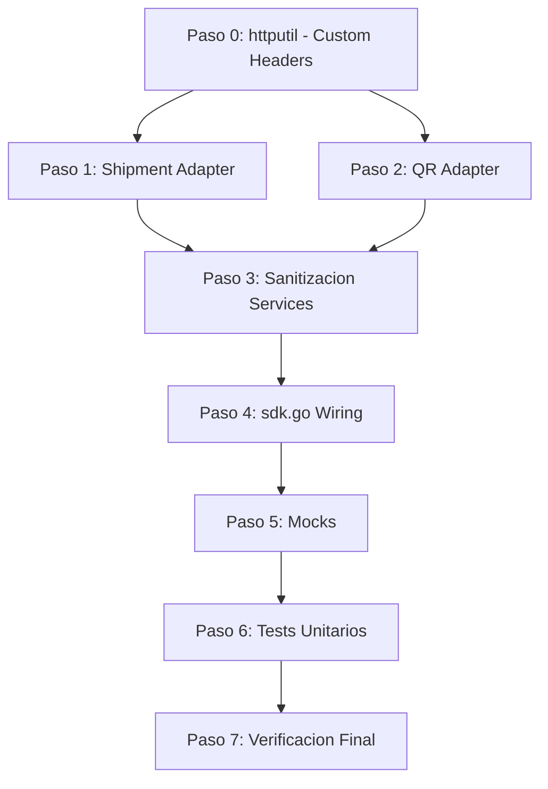

# Fase 2 + 3: Shipments y QR/Instore

## Objetivo
Implementar los adapters reales de Shipments y QR (hoy stubs que retornan `nil, nil`), conectarlos en `sdk.go`, agregar sanitizacion en los services, crear mocks y tests unitarios. Todo siguiendo el patron de referencia de `payment/`.

No se necesitan API keys: los tests usan mocks y los adapters son verificables por compilacion + `go vet`.

---

## Diagrama de Dependencias



---

## Paso 0: Extender `httputil.Client` con soporte para headers custom

**Por que**: Shipments requiere `x-format-new: true` en cada request. QR requiere `X-Idempotency-Key` en POSTs. El client actual solo pone `Content-Type`, `Accept` y `Authorization`.

**Archivo**: `pkg/httputil/client.go`

**Cambios**:
- Agregar tipo `RequestOption func(*http.Request)` para inyectar headers sin romper la API existente
- Agregar metodo `DoWithOptions(ctx, method, path, body, result, ...RequestOption) error`
- Crear helpers:
  - `WithHeader(key, value string) RequestOption`
  - `WithIdempotencyKey(key string) RequestOption` (genera UUID si key vacio)
- Los metodos existentes (`Get`, `Post`, `Put`, `Delete`) no cambian (backward compatible)
- Agregar `GetWithOptions`, `PostWithOptions` conveniences

**Patron**:
```go
type RequestOption func(*http.Request)

func WithHeader(key, value string) RequestOption {
    return func(r *http.Request) { r.Header.Set(key, value) }
}
```

---

## Paso 1: Shipment Adapter completo

### 1a. `providers/mercadolibre/shipment/models.go` (CREAR)

Structs que mapean la respuesta JSON real de ML (`GET /shipments/{id}` con `x-format-new: true`):

```
MLShipmentResponse
  - id, external_reference, status, substatus
  - tracking_number, service_id
  - date_created, last_updated
  - dimensions {height, width, length, weight}
  - logistic {direction, mode, type}
  - origin {type, sender_id, shipping_address{...}}
  - destination {type, receiver_id, receiver_name, shipping_address{...}}
  - lead_time {shipping_method, estimated_delivery_time}
  - carrier {id, name}
  
MLShippingAddress (nested)
  - address_line, street_name, street_number, zip_code
  - city{id, name}, state{id, name}, country{id, name}
  - latitude, longitude

MLShipmentHistoryResponse (para /shipments/{id}/history)
  - []MLShipmentEvent {status, substatus, date, description}

MLShipmentSearchResponse
  - paging{total, limit, offset}, results[]

MLUpdateShipmentRequest
  - tracking_number, status, receiver_id
```

Seguir el patron de `payment/models.go`: tags JSON, tipos de Go, `time.Time` para fechas.

### 1b. `providers/mercadolibre/shipment/mapper.go` (CREAR)

Funciones siguiendo patron de `payment/mapper.go`:

- `ToDomainShipment(*MLShipmentResponse) *domain.Shipment`
- `ToDomainShipments([]MLShipmentResponse) []*domain.Shipment`
- `ToDomainAddress(*MLShippingAddress) domain.Address`
- `ToDomainTrackingEvents([]MLShipmentEvent) []domain.ShipmentEvent`
- `MapShipmentStatus(string) domain.ShipmentStatus`
- `BuildShipmentSearchQuery(domain.ShipmentFilters) string` (usando `url.Values`)
- `ToMLUpdateRequest(*domain.UpdateShipmentRequest) *MLUpdateShipmentRequest`

Misma robustez que payment/mapper.go: `fmt.Sprintf` para IDs, `url.Values.Encode()` para queries.

### 1c. `providers/mercadolibre/shipment/adapter.go` (REEMPLAZAR stubs)

Reemplazar los `return nil, nil` actuales con implementacion real:

| Metodo | Implementacion |
|--------|----------------|
| `GetShipment` | GET `/shipments/{id}` + header `x-format-new: true` |
| `GetShipmentByOrder` | GET `/orders/{orderID}/shipments` + mapper |
| `ListShipments` | GET `/shipments/search?{query}` + mapper batch |
| `UpdateShipment` | PUT `/shipments/{id}` + mapper request |
| `CancelShipment` | PUT `/shipments/{id}` con `status=cancelled` |
| `GetTracking` | GET `/shipments/{id}/history` + mapper events |
| `GetLabel` | GET `/shipments/{id}/labels` (retorna `[]byte` raw, no JSON) |
| `CreateShipment` | POST via `/shipments` o asociar a orden (ML crea envios automaticamente) |

**Detalles criticos**:
- Todos los paths usan `url.PathEscape(id)` dentro de `fmt.Sprintf`
- Todas las requests usan `WithHeader("x-format-new", "true")`
- `GetLabel` usa response raw (no JSON unmarshal) - necesita nuevo metodo `DoRaw` o manejar `[]byte` directamente
- Para `GetLabel`, agregar a httputil: `DoRawWithOptions(ctx, method, path, ...RequestOption) ([]byte, error)` que retorna bytes en vez de hacer unmarshal

---

## Paso 2: QR/Instore Adapter completo

### 2a. `providers/mercadolibre/qr/models.go` (CREAR)

Structs basados en la API `/v1/orders` (nueva API QR):

```
MLCreateOrderRequest
  - type: "qr"
  - external_reference
  - notification_url
  - total_amount (float64)
  - title, description
  - pos_id (point of sale)
  - expiration_date
  - items[] {title, description, quantity, unit_price, total_amount, unit_measure}
  - cash_out {amount}
  - sponsor {id}

MLOrderResponse
  - id (prefijo ORD + 26 chars)
  - user_id, type, external_reference
  - status, status_detail
  - total_amount, paid_amount
  - items, payments
  - qr_data, order_status
  - created_date, last_updated_date

MLPOSRequest / MLPOSResponse
  - id, name, external_id, fixed_amount, category
  - store_id, url, qr{image, template_document, template_image}

MLStoreRequest / MLStoreResponse
  - id, name, external_id
  - business_hours{}, location{street_number, street_name, city, state, latitude, longitude}
```

### 2b. `providers/mercadolibre/qr/mapper.go` (CREAR)

- `ToMLCreateOrderRequest(*domain.CreateQRRequest) *MLCreateOrderRequest`
- `ToDomainQR(*MLOrderResponse) *domain.QRCode`
- `ToDomainPOS(*MLPOSResponse) *domain.POSInfo`
- `ToDomainStore(*MLStoreResponse) *domain.StoreInfo`
- `MapQRStatus(string) domain.QRStatus`
- `ToMLPOSRequest(*domain.RegisterPOSRequest) *MLPOSRequest`
- `ToMLStoreRequest(*domain.RegisterStoreRequest) *MLStoreRequest`

### 2c. `providers/mercadolibre/qr/adapter.go` (REEMPLAZAR stubs)

El adapter necesita `userID` (para endpoints de stores). Se obtiene una vez y se cachea.

Agregar al adapter:
```go
type Adapter struct {
    http     *httputil.Client
    mapper   *Mapper
    log      logger.Logger
    userID   string  // se obtiene con GET /users/me
}
```

| Metodo | Implementacion |
|--------|----------------|
| `CreateQR` | POST `/v1/orders` + `X-Idempotency-Key` header |
| `GetQR` | GET `/v1/orders/{id}` |
| `GetQRByExternalReference` | GET `/v1/orders?external_reference={ref}` |
| `DeleteQR` | POST `/v1/orders/{id}/cancel` |
| `GetQRPayment` | GET `/v1/orders/{id}` -> extraer payment info |
| `RegisterPOS` | POST `/pos` + `X-Idempotency-Key` |
| `GetPOS` | GET `/pos/{id}` |
| `ListPOS` | GET `/pos?store_id={store_id}` |
| `DeletePOS` | DELETE `/pos/{id}` |
| `RegisterStore` | POST `/users/{user_id}/stores` + `X-Idempotency-Key` |
| `GetStore` | GET `/stores/{id}` |
| `ListStores` | GET `/users/{user_id}/stores/search` |

**Detalles criticos**:
- Todo POST incluye `X-Idempotency-Key` (UUID v4 generado por el SDK si no lo provee el usuario)
- Paths con `url.PathEscape` siempre
- `userID` se resuelve lazy con `GET /users/me` la primera vez que se necesita (stores)
- Query params con `url.Values` siempre

### 2d. `pkg/idempotency/idempotency.go` (CREAR)

Paquete minimo para generar claves de idempotencia:
```go
func NewKey() string  // UUID v4 usando crypto/rand
```
Sin dependencias externas, solo `crypto/rand` + `fmt`.

---

## Paso 3: Sanitizacion en Services

### `core/usecases/shipment_service.go` (EDITAR)

Agregar `import sanitize` y sanitizar inputs como en `PaymentService`:
- `CreateShipment`: sanitize ExternalReference, Address fields
- `GetShipment`: `sanitize.ID(id)`
- `GetShipmentByOrder`: `sanitize.ID(orderID)`
- `ListShipments`: sanitize ExternalReference
- `UpdateShipment`: `sanitize.ID(id)`, sanitize Address fields
- `CancelShipment`: `sanitize.ID(id)`
- `GetTracking`: `sanitize.ID(shipmentID)`
- `GetLabel`: `sanitize.ID(shipmentID)`

### `core/usecases/qr_service.go` (EDITAR)

Agregar sanitizacion:
- `CreateQR`: sanitize ExternalReference, Description, POSID, CollectorID
- `GetQR`: `sanitize.ID(qrID)`
- `GetQRByExternalReference`: `sanitize.String(ref)`
- `DeleteQR`: `sanitize.ID(qrID)`
- `GetQRPayment`: `sanitize.ID(qrID)`
- `RegisterPOS`: sanitize Name, ExternalID, StoreID
- `GetPOS/DeletePOS`: `sanitize.ID(posID)`
- `RegisterStore`: sanitize Name, ExternalID
- `GetStore`: `sanitize.ID(storeID)`

---

## Paso 4: Wiring en `sdk.go`

**Archivo**: `sdk.go` lineas 51-68

Cambiar:
```go
// Actual (stubs vacios)
Shipment: &ShipmentAPI{},
QR:       &QRAPI{},
```

A:
```go
// Conectar providers reales
shipmentAdapter := shipment.NewAdapter(client.ShipmentsHTTP(), log)
shipmentService := usecases.NewShipmentService(shipmentAdapter, log)

qrAdapter := qr.NewAdapter(client.QRHTTP(), log)
qrService := usecases.NewQRService(qrAdapter, log)

Shipment: &ShipmentAPI{service: shipmentService},
QR:       &QRAPI{service: qrService},
```

Agregar imports para `shipment` y `qr` packages.

---

## Paso 5: Mocks para tests

### `tests/mocks/mock_shipment_provider.go` (CREAR)

Mismo patron que `mock_payment_provider.go`:
```go
type MockShipmentProvider struct {
    CreateShipmentFn    func(...) (...)
    GetShipmentFn       func(...) (...)
    GetShipmentByOrderFn func(...) (...)
    ListShipmentsFn     func(...) (...)
    UpdateShipmentFn    func(...) (...)
    CancelShipmentFn    func(...) error
    GetTrackingFn       func(...) (...)
    GetLabelFn          func(...) ([]byte, error)
}
```

### `tests/mocks/mock_qr_provider.go` (CREAR)

```go
type MockQRProvider struct {
    CreateQRFn       func(...) (...)
    GetQRFn          func(...) (...)
    // ... todos los 12 metodos del port
}
```

---

## Paso 6: Tests Unitarios

### `tests/unit/core/shipment_service_test.go` (CREAR)

Siguiendo patron de `payment_service_test.go`:
- `TestShipmentService_GetShipment` (happy path)
- `TestShipmentService_GetShipment_Validation` (id vacio)
- `TestShipmentService_GetTracking` (happy path + validation)
- `TestShipmentService_CancelShipment` (happy path + validation)
- `TestShipmentService_ListShipments` (defaults de limit)
- `TestShipmentStatus_String` (todos los valores del enum)
- `TestShipmentStatus_CanCancel` (pending/ready = true, in_transit = false)

### `tests/unit/core/qr_service_test.go` (CREAR)

- `TestQRService_CreateQR` (happy path)
- `TestQRService_CreateQR_Validation` (missing ref, invalid type, dynamic sin amount)
- `TestQRService_RegisterPOS_Validation` (missing name, missing external_id)
- `TestQRService_RegisterStore_Validation` (missing name)
- `TestQRService_GetQR_Validation` (id vacio)
- `TestQRType_IsValid` (dynamic/static = true, otros = false)
- `TestQRStatus_String` (todos los valores del enum)
- `TestQRStatus_IsFinal`

### `tests/unit/providers/shipment_mapper_test.go` (CREAR)

- `TestMapper_ToDomainShipment` (conversion completa)
- `TestMapper_MapShipmentStatus` (todos los strings de ML -> enum)
- `TestMapper_BuildShipmentSearchQuery` (verifica url.Values correcto)
- `TestMapper_ToDomainAddress` (nested address)

### `tests/unit/providers/qr_mapper_test.go` (CREAR)

- `TestMapper_ToMLCreateOrderRequest` (domain -> ML)
- `TestMapper_ToDomainQR` (ML -> domain)
- `TestMapper_MapQRStatus` (todos los strings -> enum)
- `TestMapper_ToDomainPOS` / `TestMapper_ToDomainStore`

---

## Paso 7: Verificacion Final

- `go build ./...` - compilacion limpia
- `go vet ./...` - sin warnings
- `go test ./tests/... -v` - todos los tests pasan
- Grep por concatenacion insegura: `"string" + var` no debe existir en archivos nuevos
- Grep por `interface{}` - debe ser `any` en todo el proyecto
- Verificar que ningun archivo en `core/` importa `providers/`

---

## Resumen de archivos

| Accion | Archivo |
|--------|---------|
| EDITAR | `pkg/httputil/client.go` (agregar RequestOption + DoWithOptions + DoRaw) |
| CREAR | `pkg/idempotency/idempotency.go` |
| CREAR | `providers/mercadolibre/shipment/models.go` |
| CREAR | `providers/mercadolibre/shipment/mapper.go` |
| EDITAR | `providers/mercadolibre/shipment/adapter.go` (reemplazar stubs) |
| CREAR | `providers/mercadolibre/qr/models.go` |
| CREAR | `providers/mercadolibre/qr/mapper.go` |
| EDITAR | `providers/mercadolibre/qr/adapter.go` (reemplazar stubs) |
| EDITAR | `core/usecases/shipment_service.go` (agregar sanitize) |
| EDITAR | `core/usecases/qr_service.go` (agregar sanitize) |
| EDITAR | `sdk.go` (wiring real) |
| CREAR | `tests/mocks/mock_shipment_provider.go` |
| CREAR | `tests/mocks/mock_qr_provider.go` |
| CREAR | `tests/unit/core/shipment_service_test.go` |
| CREAR | `tests/unit/core/qr_service_test.go` |
| CREAR | `tests/unit/providers/shipment_mapper_test.go` |
| CREAR | `tests/unit/providers/qr_mapper_test.go` |

Total: 10 archivos nuevos, 5 archivos editados

## Verification / DoD

| Check | Criterio |
|-------|----------|
| Compilacion | `go build ./...` sin errores |
| Static analysis | `go vet ./...` limpio |
| Tests | `go test ./tests/... -v` todos pasan |
| Seguridad strings | `grep -rn '".*" +' --include="*.go"` sin concatenaciones inseguras en archivos nuevos |
| Clean arch | `grep -rn 'providers/' core/` retorna 0 resultados |
| Modernidad | `grep -rn 'interface{}' --include="*.go"` retorna 0 resultados |
| Sanitizacion | Todos los IDs pasan por `sanitize.ID()`, todos los strings por `sanitize.String()` |

## Trazabilidad Paso -> Archivos -> Verificacion

| Paso | Archivos target | Verificacion |
|------|----------------|--------------|
| 0 | `pkg/httputil/client.go` | `go build ./...` compila |
| 1 | `providers/ml/shipment/{models,mapper,adapter}.go` | `go build ./...` + grep seguridad |
| 2 | `providers/ml/qr/{models,mapper,adapter}.go`, `pkg/idempotency/` | `go build ./...` + grep seguridad |
| 3 | `core/usecases/{shipment,qr}_service.go` | `go build ./...` + grep sanitize |
| 4 | `sdk.go` | `go build ./...` + `grep providers/ core/` = 0 |
| 5 | `tests/mocks/mock_{shipment,qr}_provider.go` | `go build ./tests/...` |
| 6 | `tests/unit/**/*_test.go` | `go test ./tests/... -v` todo verde |
| 7 | Todos | Todas las checks de DoD |
